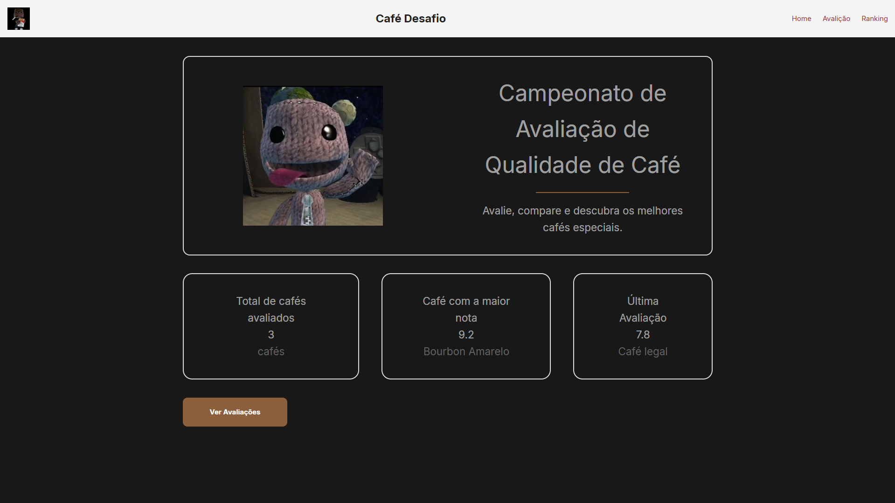
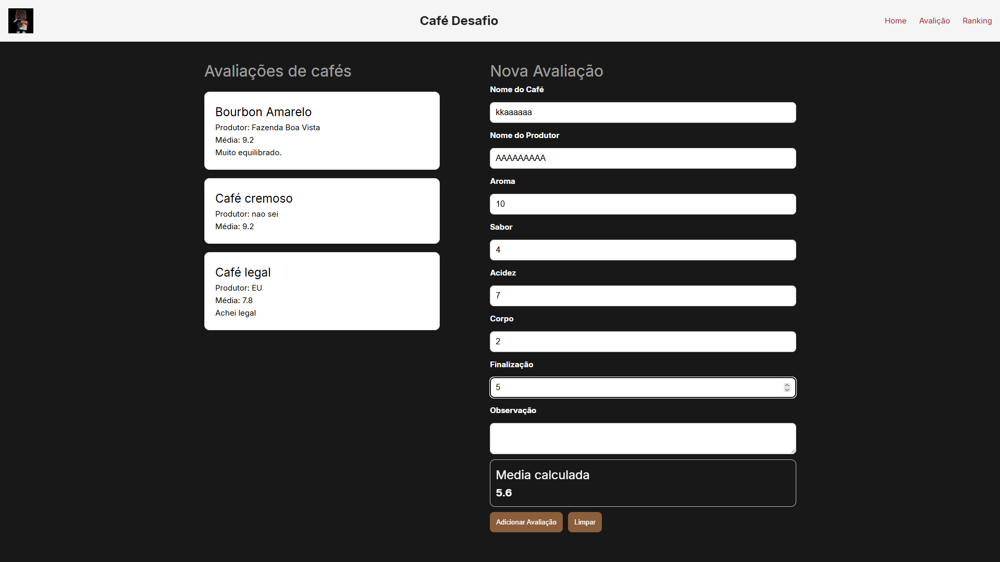
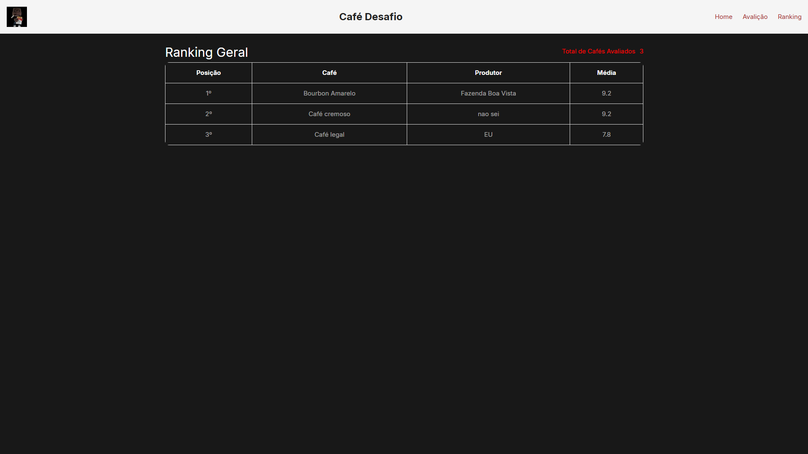

# ☕ Coffee Quality Challenge

## Identificação

**Nome:** Clara Kellermann dos Santos  
**Turma:** 2info2  
**Disciplina:** Desenvolvimento Web

---

## Sobre o Projeto

O projeto consiste em um sistema para avaliação de cafés especiais. Os usuários podem cadastrar cafés, atribuir notas para diferentes critérios sensoriais e visualizar um ranking com base na média das avaliações.

---

## Tecnologias Utilizadas

- Vue 3
- Vue Router
- Vite
- JavaScript
- HTML
- CSS

---

## Como Executar o Projeto

### Executar localmente

```bash
npm install
npm run dev
```

### Acessar online

Projeto publicado na Vercel:

**https://projeto-caf.vercel.app**

---

## Funcionalidades Implementadas

- ✅ Página Home
- ✅ Cadastro de avaliações
- ✅ Listagem dos cafés avaliados
- ✅ Cálculo automático da média
- ✅ Ranking dos cafés
- ✅ Limpeza do formulário
- ✅ Validação dos campos obrigatórios

---

## Conceitos Vue.js Utilizados

### Componentes

- CoffeeCard.vue
- RatingForm.vue
- LeaderboardTable.vue

### Props

Utilizadas para enviar os dados dos cafés para os componentes.

### Reactive State (ref)

Utilizado para armazenar os dados do formulário e da lista de cafés.

### Computed

Utilizado para:

- calcular o total de cafés;
- encontrar o café com maior média;
- ordenar os cafés no ranking.

### Diretivas

- `v-for` para listar cafés.
- `v-model` para os campos do formulário.
- `v-if` quando necessário.
- `@click` para os botões.

### Vue Router

Utilizado para navegar entre:

- Home
- Avaliações
- Ranking

---

## Evidências da Aplicação

### Home



### Avaliações



### Ranking



